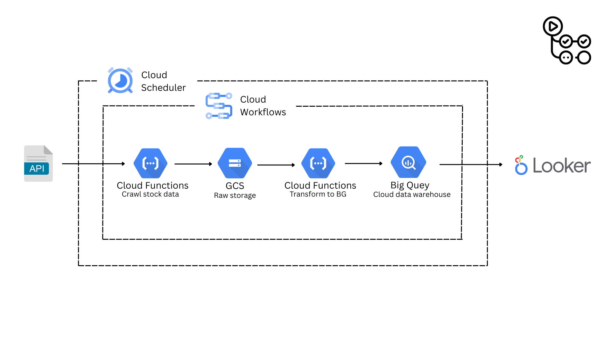
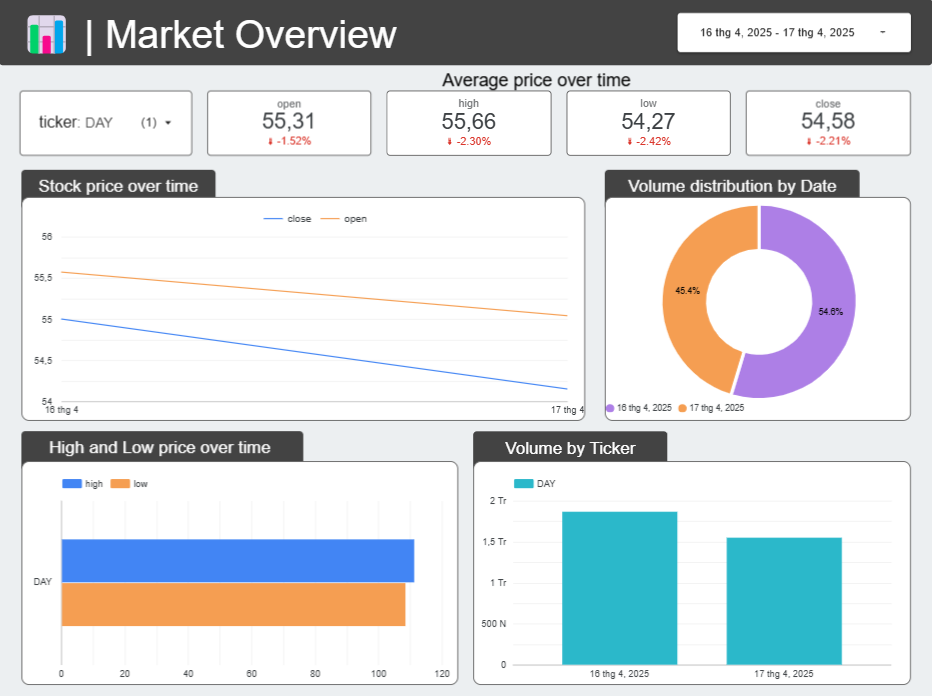
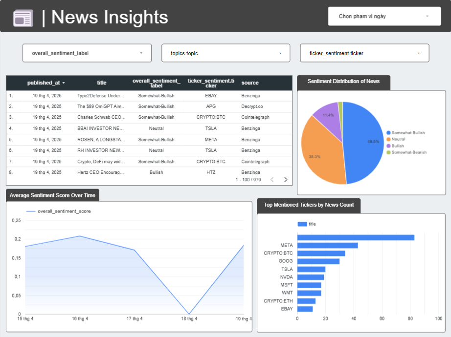

# Stock Pipeline: Price & Sentiment Analysis

A fully serverless data pipeline that crawls stock OHLC data and financial news sentiment daily, stores raw data in GCS, processes it with Cloud Functions using Pandas, and visualizes it in Looker Studio using BigQuery.

## Table of Contents
- [Features](#features)
- [Architecture Diagram](#architecture-diagram)
- [Demo Dashboard](#demo-dashboard)
- [Schedule](#schedule)
- [Tech Stack](#tech-stack)
- [Repository Structure](#repository-structure)
- [Deployment (Manual)](#deployment-manual)
  - [1. Deploy crawl function](#1-deploy-crawl-function)
  - [2. Deploy transform function](#2-deploy-transform-function)
  - [3. Deploy Workflow](#3-deploy-workflow)
  - [4. Setup Scheduler](#4-setup-scheduler)
- [GitHub Actions (CI/CD)](#github-actions-cicd)
- [Example Output](#example-output)

## Features
- ✅ Daily automated data collection (OHLC & News)
- ✅ GCS for raw data storage
- ✅ Cloud Function ETL with Pandas
- ✅ Cloud Workflows + Scheduler orchestration
- ✅ Slack notification after pipeline completes
- ✅ BigQuery as central warehouse
- ✅ Looker Studio dashboard
- ✅ CI/CD with GitHub Actions

## Architecture Diagram
<div align="center">
  
</div>

## Demo Dashboard
<div align="center">
  <a href="https://lookerstudio.google.com/reporting/ca861010-269d-4d16-9b9d-01084ae68373" target="_blank">
    
    
  </a>
  <p><a href="https://lookerstudio.google.com/reporting/ca861010-269d-4d16-9b9d-01084ae68373" target="_blank">View Full Dashboard</a></p>
</div>

## Schedule
- Runs every day at **12:00PM Vietnam time** (05:00 UTC) using **Cloud Scheduler**
- Executes `Cloud Workflow` which:
  1. Triggers data crawling
  2. Transforms data
  3. Loads to BigQuery
  4. Sends a Slack alert

## Tech Stack
| Component | Tool |
|-----------|------|
| Crawl data | Cloud Functions (Python) |
| Raw storage | GCS |
| Transform | Cloud Function + Pandas |
| Warehouse | BigQuery |
| Orchestration | Cloud Workflows |
| Automation | Cloud Scheduler |
| CI/CD | GitHub Actions |
| Monitoring | Slack Webhook |
| Visualization | Looker Studio |

## Repository Structure
```
stock-pipeline/
├── .gitignore                 
├── README.md                  
├── .github/
│   └── workflows/
│       └── deploy.yml          
├── cloud_functions/
│   ├── crawl_stock_data/
│   │   ├── main.py             
│   │   ├── requirements.txt    
│   │   └── utils/
│   │       ├── alphavantage_api.py  
│   │       ├── gcs_helper.py        
│   │       └── polygon_api.py       
│   └── transform_to_bq/
│       ├── main.py             
│       └── requirements.txt    
├── cloud_workflows/
│   └── workflow.yaml           
└── img/

```

## Deployment (Manual)

### 1. Deploy crawl function:
```bash
gcloud functions deploy crawl_stock_data_entrypoint \
  --runtime python310 \
  --region asia-southeast1 \
  --trigger-http \
  --entry-point crawl_stock_data_entrypoint \
  --source=cloud_functions/crawl_stock_data \
  --set-env-vars POLYGON_API_KEY=xxx,ALPHAVANTAGE_API_KEY=xxx,BUCKET_NAME=xxx \
  --allow-unauthenticated
```

### 2. Deploy transform function:
```bash
gcloud functions deploy transform_to_bq_entrypoint \
  --runtime python310 \
  --region asia-southeast1 \
  --trigger-http \
  --entry-point transform_to_bq_entrypoint \
  --source=cloud_functions/transform_to_bq \
  --set-env-vars BUCKET_NAME=xxx,BQ_DATASET=xxx \
  --allow-unauthenticated
```

### 3. Deploy Workflow:
```bash
gcloud workflows deploy stock_pipeline_workflow \
  --source=cloud_workflows/workflow.yaml \
  --location=asia-southeast1 \
  --set-env-vars SLACK_WEBHOOK_URL=https://hooks.slack.com/services/xxx
```

### 4. Setup Scheduler:
```bash
gcloud scheduler jobs create http stock-pipeline-job \
  --schedule="0 7 * * *" \
  --uri="https://workflowexecutions.googleapis.com/v1/projects/PROJECT_ID/locations/asia-southeast1/workflows/stock_pipeline_workflow/executions" \
  --http-method=POST \
  --oauth-service-account-email=YOUR_SA_EMAIL \
  --location=asia-southeast1
```

## GitHub Actions (CI/CD)
- Auto deploy Cloud Functions & Workflows when folders are modified.
- Uses `google-github-actions/auth` and `gcloud` CLI
- Secrets required:
  - `GCP_SA_KEY`
  - `POLYGON_API_KEY`, `ALPHAVANTAGE_API_KEY`
  - `SLACK_WEBHOOK_URL`

## Example Output
```
✅ Uploaded News.
✅ Uploaded OHLCs.
✅ Slack sent: "Stock pipeline completed! (Time: 2025-04-18 14:00 GMT+7)"
```
